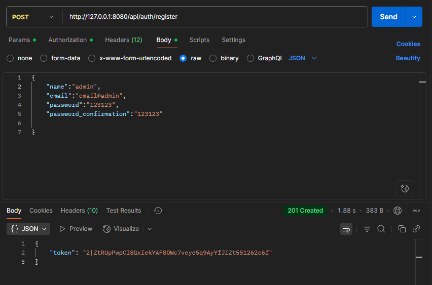

## Application System (Laravel API)

Небольшой API-сервис на Laravel с аутентификацией через Sanctum и сущностями: `leads`, `sources`, `comments`.

### Быстрый старт (локально)

```bash
composer install
cp .env.example .env
php artisan key:generate
php artisan migrate
php artisan serve
```

По умолчанию сервер поднимется на `http://127.0.0.1:8080`. API-доступ по префиксу `/api`.

### Быстрый старт (Docker)

```bash
docker compose up -d --build
# сайт: http://localhost:8080
# MySQL: 127.0.0.1:3307 (db: app, user: app, pass: secret)
```

### Как получить токен

Есть два пути: регистрация или логин. Оба возвращают `token`.

1) Регистрация: `POST /api/auth/register`

Body JSON:
```json
{ "name": "John", "email": "john@example.com", "password": "123456", "password_confirmation": "123456" }
```

2) Логин: `POST /api/auth/login`

Body JSON:
```json
{ "email": "john@example.com", "password": "secret" }
```

Ответ обоих методов:
```json
{ "token": "<SANCTUM_TOKEN>" }
```

Используйте токен в заголовке: `Authorization: Bearer <SANCTUM_TOKEN>`.

### Эндпоинты

- Auth
  - `POST /api/auth/register` — регистрация, возвращает токен
  - `POST /api/auth/login` — логин, возвращает токен
  - `POST /api/auth/logout` — выход (требуется авторизация)

- Leads
  - `POST /api/leads` — создать лид (публично, без токена)
  - `GET /api/leads` — список лидов (auth)
  - `GET /api/leads/{id}` — получить лид (auth)
  - `PUT /api/leads/{id}` — обновить лид (auth)
  - `DELETE /api/leads/{id}` — удалить лид (auth)

- Comments
  - `GET /api/leads/{id}/comments` — комментарии лида (auth)
  - `POST /api/leads/{id}/comments` — добавить комментарий (auth)
  - `DELETE /api/comments/{id}` — удалить комментарий (auth)

- Sources
  - `GET /api/sources` — список (auth)
  - `POST /api/sources` — создать (auth)
  - `PUT /api/sources/{id}` — обновить (auth)
  - `DELETE /api/sources/{id}` — удалить (auth)

### Примеры curl

1) Регистрация пользователя и получение токена
```bash
curl -s -X POST http://127.0.0.1:8080/api/auth/register -H "Content-Type: application/json"  -H "Accept: application/json" -d '{"name":"John","email":"john@example.com","password":"secret","password_confirmation":"secret"}'
```

2) Логин пользователя и получение токена
```bash
curl -s -X POST http://127.0.0.1:8080/api/auth/login -H "Content-Type: application/json"  -H "Accept: application/json" -d '{"email":"john@example.com","password":"secret"}'
```

3) Создать лид (публично)
```bash
curl -X POST http://127.0.0.1:8080/api/leads -H "Content-Type: application/json" -H "Accept: application/json" -d '{"name":"Иван","email":"ivan@example.com","message":"Заявка"}'
```

4) Получить список лидов (нужен токен)
```bash
curl -X http://127.0.0.1:8080/api/leads -H "Content-Type: application/json" -H "Accept: application/json" -H "Authorization: Bearer $TOKEN" 
```

### Заметки

- Авторизация: Laravel Sanctum, заголовок `Authorization: Bearer <token>`.
- Миграции выполняются командой `php artisan migrate` или автоматически при старте контейнера (если включено).
- Переменные окружения БД задаются в `.env` или в `docker-compose.yml` (сервис `db`).
- Приложение тестировалось на Windows 10 с использованием xampp и Postman.


